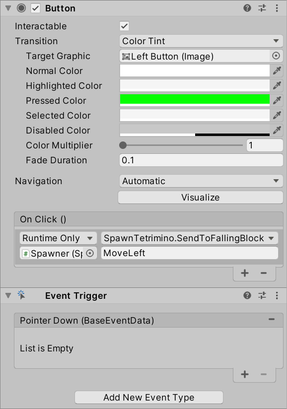

# Lukas' Tetris game

## Problem

The UI buttons are calling the `Move...` functions on the wrong object. They need to send it to the currently falling block.

## The Fix

Forward the `Move...` messages to the currently falling block.

In the `SpawnTetromino` class, add a variable to keep a reference to the currently falling block.

```csharp
    GameObject fallingBlock = null;
```

When a new falling block is created, you can overwrite the value of this variable:

```csharp
    public void NewTetrimino()
    {
        fallingBlock = Instantiate(Tetriminoes[Random.Range(0, Tetriminoes.Length)], transform.position, Quaternion.identity);
    }
```

Then add a new function to forward messages to the currently falling block:

```csharp
    public void SendToFallingBlock(string message)
    {
        fallingBlock.SendMessage(message);
    }
```

Finally, for each of the buttons, in the `On Click ()` box, drag in the Spawner object, select the `SpawnTetromino.SendToFallingBlock` function, and set the message to `MoveLeft`, `MoveRight`, `MoveDown`, and `Rotate` respectively.


